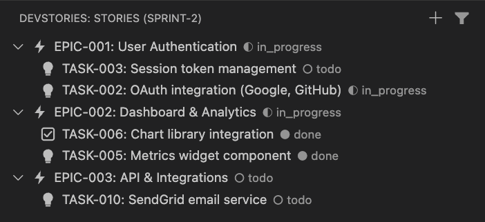
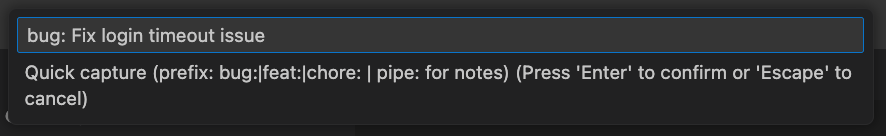
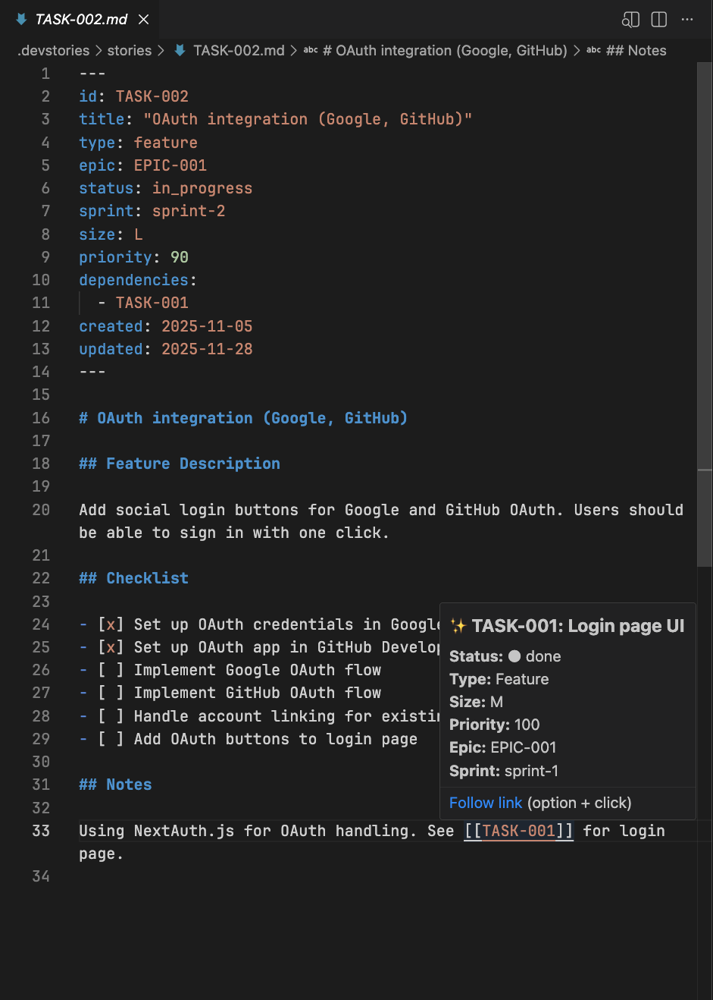
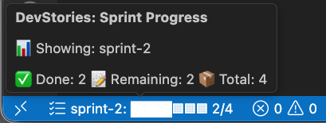
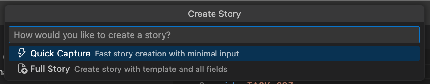

# DevStories

[](https://github.com/dhavalsavalia/DevStories/actions/workflows/ci.yml)
[](https://marketplace.visualstudio.com/items?itemName=DhavalSavalia.devstories)
[](https://marketplace.visualstudio.com/items?itemName=DhavalSavalia.devstories)
[](https://marketplace.visualstudio.com/items?itemName=DhavalSavalia.devstories)
[](https://marketplace.visualstudio.com/items?itemName=DhavalSavalia.devstories)

**Lightweight story management in VS Code. Stories that travel with your code.**

Stories live as markdown files in your repo—version-controlled, AI-accessible, and completely free.




## Features

### 📁 Tree View with Sprint Filtering
Organize work into epics and stories. Filter by sprint to focus on what matters now.

### ⚡ Quick Capture
Press `Cmd+Shift+S` to capture ideas without leaving your code. Supports type prefixes (`bug:`, `feat:`) and inline notes.



### 🔗 Inline Preview
Hover over any `[[TASK-001]]` link to see the full story card—status, type, size, sprint, and more.



### 📊 Sprint Progress
Status bar shows real-time progress for your filtered sprint.



### ➕ Create Stories Your Way
Use quick capture for fast ideas or the full form for detailed stories with templates.



### More Features
- **Story Templates** — Different templates per type (feature/bug/task/chore)
- **Auto-timestamps** — `updated` field auto-updates on save
- **Status Toggle** — Right-click to change status
- **Clickable Links** — `[[STORY-ID]]` links open the story file

## Quick Start

1. **Install** from VS Code Marketplace (search "DevStories")

2. **Initialize** — Run `DevStories: Init` from Command Palette (`Cmd+Shift+P`)

3. **Create your first epic** — Run `DevStories: Create Epic`

4. **Start capturing stories** — Press `Cmd+Shift+S` or click the `+` button

## Keyboard Shortcuts

| Action | Shortcut |
|--------|----------|
| Quick Capture | `Cmd+Shift+S` |
| Command Palette | `Cmd+Shift+P` |

## Configuration

DevStories stores configuration in `.devstories/config.json`:

```json
{
  "project": "My Project",
  "idPrefix": {
    "epic": "EPIC",
    "story": "STORY"
  },
  "statuses": [
    { "id": "todo", "label": "To Do" },
    { "id": "in_progress", "label": "In Progress" },
    { "id": "done", "label": "Done" }
  ],
  "sprints": {
    "current": "sprint-1",
    "sequence": ["sprint-1", "sprint-2", "backlog"]
  }
}
```

## File Structure

```
your-project/
└── .devstories/
    ├── config.json
    ├── epics/
    │   ├── EPIC-001.md
    │   └── EPIC-INBOX.md
    ├── stories/
    │   ├── STORY-001.md
    │   └── STORY-002.md
    └── templates/
        └── feature.md
```

## Contributing

See [CONTRIBUTING.md](CONTRIBUTING.md) for development setup.

## License

MIT
